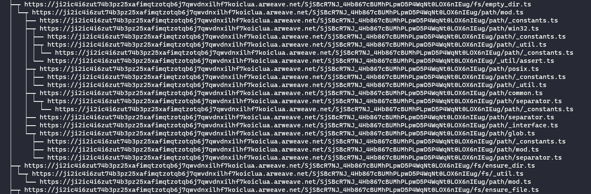
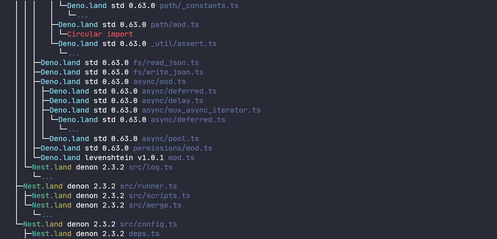

# Dependency tree

It can be tricky to visualize the dependencies of a project using our registry.
Indeed, the `deno info` command displays the arweave URLs and this is to be expected because that's where the files are located.



You can then use the `eggs info` command which addresses this problem and improves the appearance of the tree.
Redundant imports (which are already elsewhere in the tree) are represented by `...` to save space.

```shell script
eggs info
```



## Options

### --full

It is possible to view the entire tree with the `--full` option. This will replace the `...` with the relevant imports.

> Warning, this is not recommended on large trees.

### --raw

If you want to display URLs without beautification, this option will simply display the base URLs.

